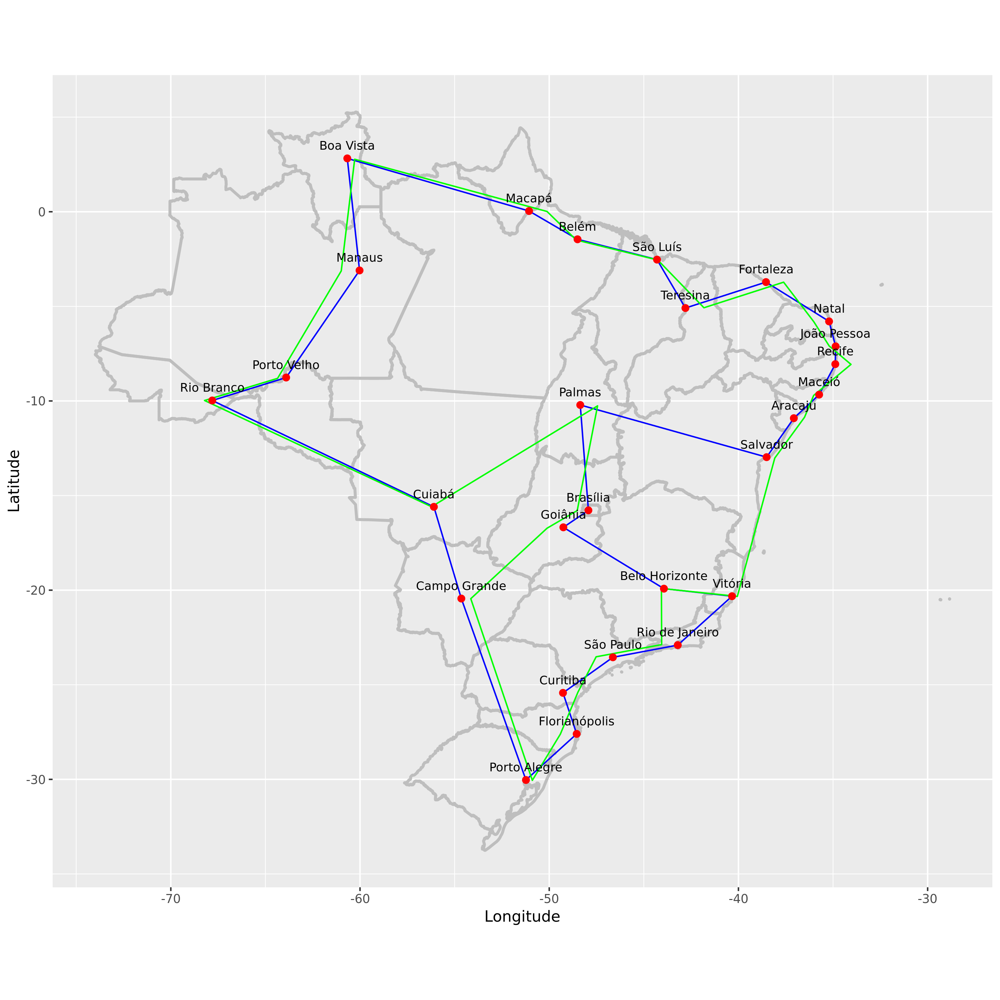

```{r,echo=F}
knitr::opts_chunk$set(
  cache=T,
  collapse=T,
  comment="#>",
  dpi=96,
  fig.align="center",
  out.width='100%',
  echo=F
)
```

We use the [concorde](http://www.math.uwaterloo.ca/tsp/concorde.html) library to compute traveling salesman "tours" for the 27 brazilian capitals geocoded in file `data/capitais.csv`. Below you see two such tours (blue and green) computed using different TSP heuristics.

```{r,out.width="50%",fig.align="center"}

```

Coding details can be found [here](https://dan-reznik.github.io/TSP-Brazilian-Capitals)
